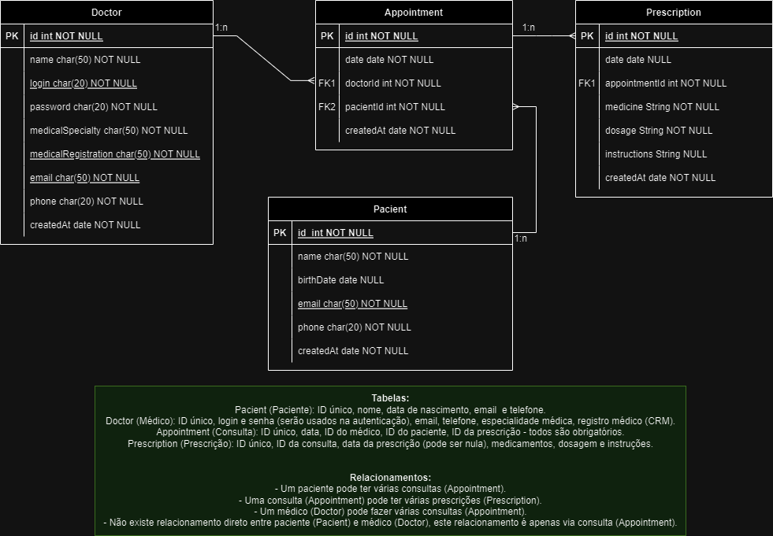

<h1 align="center">Med App 👩🏻‍⚕️🩺</h1>

  
  <a href="#-screenshots">Screenshots</a>&nbsp;&nbsp;&nbsp;|&nbsp;&nbsp;&nbsp;
  <a href="#-technologies">Technologies</a>&nbsp;&nbsp;&nbsp;|&nbsp;&nbsp;&nbsp;
  <a href="#-features">Features</a>&nbsp;&nbsp;&nbsp;|&nbsp;&nbsp;&nbsp;
  <a href="#-project">Project</a>&nbsp;&nbsp;&nbsp;|&nbsp;&nbsp;&nbsp;
  <a href="#-license">License</a>&nbsp;&nbsp;&nbsp;|&nbsp;&nbsp;&nbsp;
  <a href="#-contributing">Contributing</a>&nbsp;&nbsp;&nbsp;|&nbsp;&nbsp;&nbsp;
  <a href="#support">Support</a>  

  

 

## 📸 Screenshots

 

 

## 🛠 Technologies

- Node.js — JavaScript runtime environment
- Express — Web framework for Node.js
- MongoDB — NoSQL database
- Mongoose — ODM (Object Data Modeling) library for MongoDB
- bcrypt — Password hashing library
- jsonwebtoken (JWT) — Token-based authentication
- Multer — Middleware for handling file uploads
- PDFKit — Library for generating PDF documents
- Git and GitHub

 

## ✨ Features

- User authentication with password hashing (bcrypt)
- JSON Web Token (JWT) for secure authorization
- RESTful API built with Express
- File uploads handling with Multer
- PDF generation using PDFKit
- MongoDB database integration via Mongoose

 

## 💻 Project

- This project was developed as part of a college course and implements authentication, file uploads, PDF generation, and database management.

 

## 📜 License

- This project is licensed under the [MIT License](https://choosealicense.com/licenses/mit/)

 

## 🫱🏻‍🫲🏻 Contributing

 Contributions, issues, and feature requests are welcome! Please, feel free to do it! 😉 

 

## 🌟 Support

 If you like this project, please give it a star ⭐ and share it with others! 😄 

